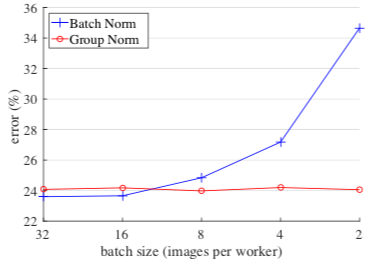
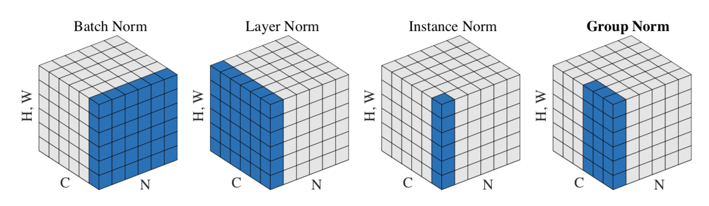
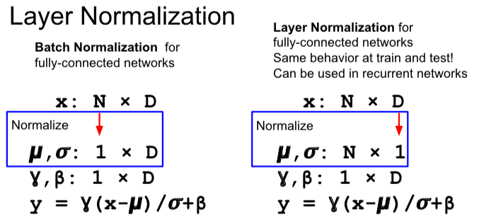
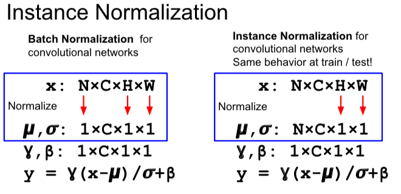

# Group Normalization
Jan 15, 2019

---
本文是对[Group Normalization - Yuxin Wu, Kaiming He](https://arxiv.org/abs/1803.08494)的笔记。记录除了Batch Norm的一些normalization的方法，如Layer Norm, Instance Norm和Group Norm。包括intuition和实际的implementation。

## No free hunch!
首先，为什么要使用除了BN以外的Normalization方法？BN通过减少internal covariate shift达到提高训练的目的，还可以降低对weight初始化的依赖。
但是在较大模型的计算机视觉任务中（如detection, segmentation, video），由于存储空间限制需要用到小的batch。而BN方法的错误率会随着batch size变小而急剧上升。
<div align=center></div>

## Alternative to BN
这里就引出了除了BN之外的其他normalization的方法。


### Layer Norm
在FC层中，layer norm和batch norm很像。区别在于BN是分别在每一个feature下对所有sample取均值和方差。而layer norm正好相反，是分别对每一个sample里对所有feature取均值和方差。
<div align=center></div>
在实际代码部署中也有一个小技巧就是基本保留原有的BN代码，只在关键的地方取转置。下面截取我在CS231n Assignment 2中的代码。

```python
def layernorm_forward(x, gamma, beta, ln_param):
    """
    Input:
    - x: Data of shape (N, D)
    - gamma: Scale parameter of shape (D,)
    - beta: Shift paremeter of shape (D,)
    - ln_param: Dictionary with the following keys:
        - eps: Constant for numeric stability

    Returns a tuple of:
    - out: of shape (N, D)
    - cache: A tuple of values needed in the backward pass
    """
    out, cache = None, None
    eps = ln_param.get('eps', 1e-5)

    # simply transpose the input matrix x, and then just copy the forward pass from BN
    x = x.T
    x_mean = np.mean(x, axis=0)
    x_var = np.var(x, axis=0)
    x_hat = (x - x_mean) / np.sqrt(x_var + eps)
    x_hat = x_hat.T
    out = gamma * x_hat + beta

    cache = (x, x_hat, x_mean, x_var, gamma, beta, eps)

    return out, cache

def layernorm_backward(dout, cache):
    """
    Inputs:
    - dout: Upstream derivatives, of shape (N, D)
    - cache: Variable of intermediates from layernorm_forward.

    Returns a tuple of:
    - dx: Gradient with respect to inputs x, of shape (N, D)
    - dgamma: Gradient with respect to scale parameter gamma, of shape (D,)
    - dbeta: Gradient with respect to shift parameter beta, of shape (D,)
    """
    dx, dgamma, dbeta = None, None, None
    x, x_hat, x_mean, x_var, gamma, beta, eps = cache

    dbeta = np.sum(dout, axis=0)
    dgamma = np.sum(x_hat*dout, axis=0)

    dxhat = dout * gamma
    dxhat = dxhat.T
    x_hat = x_hat.T
    # Remember the shape now is transposed. 
    N, D = np.shape(dxhat)
    dx = (1. / N) * (1.0 / np.sqrt(x_var + eps))
         * (N*dxhat - np.sum(dxhat, axis=0) 
         - x_hat*np.sum(dxhat*x_hat, axis=0))
    dx = dx.T

    return dx, dgamma, dbeta
```

### Batch Norm for CNN and Instance Norm
除了FC层，BN同样可以应用在CNN的卷积层中。FC中$X$的形状为$(N, D)$，BN会取形状为$(1, D)$的均值和方差。而CNN中的$X$的形状为$(N, C, H, W)$，BN则取形状为$(1, C, 1, 1)$的均值和方差。这里的C为channel（如CNN网络输入的channel为RGB3个，后面的channel个数取决于kernel的数量）。
<div align=center></div>

将BN for CNN(Spatial Batchnorm)部署成code，由于计算出的均值和方差都只保留了一个维度（C），可以套用FC的BN。只需要做一些输入形状上的变形。首先将$(N, C, H, W)$转置为$(N, H, W, C)$，再把前3个维度合并，最终$X$的形状为$(-1, C)$。在经过BN的操作之后，最后还原原本的形状$(N, C, H, W)$。

```python
def spatial_batchnorm_forward(x, gamma, beta, bn_param):
    """
    bn_param: Dictionary with the following keys:
    mode: 'train' or 'test', eps, momentum, running_mean, running_var
    """

    out, cache = None, None

    N, C, H, W = x.shape
    # reshape x to (N*H*W, C)
    x_reshape = np.reshape(x.transpose(0, 2, 3, 1), (-1, C))
    out, cache = batchnorm_forward(x_reshape, gamma, beta, bn_param)
    out = out.reshape(N, H, W, C).transpose(0, 3, 1, 2)

    return out, cache
```
反向传输也是类似。先把$\operatorname{d}out$进行变形，然后BN的反向传输操作，最后将$\operatorname{d}X$变成和$X$相同的形状。

```python
def spatial_batchnorm_backward(dout, cache):

    dx, dgamma, dbeta = None, None, None

    N, C, H, W = dout.shape
    # reshape dout to (N*H*W, C)
    dout_reshape = np.reshape(dout.transpose(0, 2, 3, 1), (-1, C))
    dx, dgamma, dbeta = batchnorm_backward(dout_reshape, cache)
    dx = dx.reshape(N, H, W, C).transpose(0, 3, 1, 2)

    return dx, dgamma, dbeta
```

### Group Norm
GN的直观解释来源于经典的特征方法SIFT，HOG和GIST。这些都是group-wise的表示方法，每一个channel的组由某种直方图构成。这些特征通常会在每个直方图或者每个方向上进行group-wise normalization。
从深度神经网络的角度看，通过CNN的每个filter(or kernel)都在学习的到一种特征。比如，有理由相信一个filter和其自身的水平翻转的response会呈现出类似的分布。所以两个filter的response可以被normalize。另外更高的层可以抽象出更多的特征，存在许多可以grouping的因素（如频率，形状，照度，质感等）。
事实上一个被广泛接受的神经学计算模型就是在各种感受野中心以及各种时空频率上normalize across the cell responses。

Group Norm类似于Layer Norm，只不过LN保留了所有channel的维度，而GN会将channel分成G个组，每个组内拥有相同的均值和方差。
具体的代码如下，先将$X$ reshape成$(group \ size * H * W, N * G)$，再重复BN的正向过程，保留$N*G$的维度。再将结果reshape成$X$的形状，并做线性变换。

```python
def groupnorm_forward(x, gamma, beta, G, gn_param):
    """
    Inputs:
    - x: Input data of shape (N, C, H, W)
    - gamma: Scale parameter, of shape (C,)
    - beta: Shift parameter, of shape (C,)
    - G: Integer mumber of groups to split into, should be a divisor of C
    - gn_param: Dictionary with the following keys:
      - eps: Constant for numeric stability

    Returns a tuple of:
    - out: Output data, of shape (N, C, H, W)
    - cache: Values needed for the backward pass
    """
    out, cache = None, None
    eps = gn_param.get('eps',1e-5)

    N, C, H, W = x.shape
    #group_size = C // G
    # resize x to (group_size * H * W, N * G)
    x_reshape = np.reshape(x, (N * G, -1)).T

    x_mean = np.mean(x_reshape, axis=0)
    x_var = np.var(x_reshape, axis=0)
    x_hat = (x_reshape - x_mean) / np.sqrt(x_var + eps)
    x_hat = x_hat.T
    # reshape x_hat into (N, C, H, W), because gamma and beta are (C, )
    x_hat = np.reshape(x_hat, (N, C, H, W))
    out = gamma * x_hat + beta

    cache = (x_reshape, x_hat, x_mean, x_var, gamma, beta, eps, G)

    return out, cache
```
Group Norm的反向传输也类似于BN。需要注意的是，求beta和gamma的梯度时，需要保留channel的维度并在其他维度上求和。先reshape $\operatorname{d}xhat$和$xhat$，再重复BN的反向传输过程，最终得到x的梯度再reshape成x的形状。

```python
def groupnorm_backward(dout, cache):
    """

    Inputs:
    - dout: Upstream derivatives, of shape (N, C, H, W)
    - cache: Values from the forward pass

    Returns a tuple of:
    - dx: Gradient with respect to inputs, of shape (N, C, H, W)
    - dgamma: Gradient with respect to scale parameter, of shape (C,)
    - dbeta: Gradient with respect to shift parameter, of shape (C,)
    """
    dx, dgamma, dbeta = None, None, None

    x, x_hat, x_mean, x_var, gamma, beta, eps, G= cache
    N, C, H, W = dout.shape

    # axis equal to axis(dimension) you don't want to remain
    # keepdims=True to output shape (1, C, 1, 1)
    dbeta = np.sum(dout, axis=(0, 2, 3), keepdims=True)
    dgamma = np.sum(x_hat*dout, axis=(0, 2, 3), keepdims=True)

    dxhat = np.reshape(dout * gamma, (N * G, -1)).T
    x_hat = np.reshape(x_hat, (N * G, -1)).T

    # start the bn backward
    # rename the dimension here to differ dout.shape
    N_r, D_r = np.shape(dxhat)
    dx = (1. / N_r) * (1.0 / np.sqrt(x_var + eps))
         * (N_r*dxhat - np.sum(dxhat, axis=0) 
         - x_hat*np.sum(dxhat*x_hat, axis=0))
    dx = dx.T
    dx = np.reshape(dx, (N, -1, H, W))

    return dx, dgamma, dbeta
```