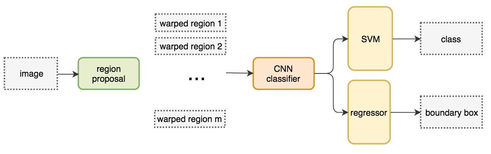

# Object Detection Notebook
Feb, 2019
___

这篇笔记是对Object detection系列任务的流行架构进行的整理。

## Faster R-CNN

Faster R-CNN是基于R-CNN 和 Fast R-CNN之上的改进，在保证准确度的基础上极大地提高了网络在inference时的速度。

<em>R-CNN</em>采用如Selective Search的方法首先在原图上选取region proposals(速度和准确度trade-off下大约2000多个)，再将这些proposal转换成相同的size输入一个CNN网络。最终对所在region做classification得到class，以及regression使当前region的bounding box得到偏移从而接近ground truth。

 R-CNN structure

Selective Search:
1. 第一步
2. 
3. 

<em>Fast R-CNN</em>是基于R-CNN的优化。在R-CNN中，所有的region proposals都要分别进入CNN进行计算，降低了速度。Fast R-CNN的region proposal选取仍然采用如Selective Search之类的方法，但是基于原图产生的的region proposals并不在原图上截取，而是先将原图通过一个feature extractor(一个CNN网络)产生feature maps，再在特征图上截取。然后将截取的块通过ROI pooling变成相同size，最后由全连接层输出。这样做的好处在于可以重复利用feature extractor的卷积计算从而加快速度。

 Fast R-CNN structure

但同样是region-based的方法，Fast R-CNN的速度被生成region proposal的速度限制了。可以看到下图中，Fast R-CNN的test time为2.3秒，其中大约2秒的时间被用于生成ROI。

  

Faster R-CNN使用<em>Region Proposal Network(RPN)</em>来生成ROI。

## R-FCN

## SSD and YOLO

## Speed/accuracy trade-offs for modern convolutional object detectors

## Mask R-CNN

## Reference
- [Speed/accuracy trade-offs for modern convolutional object detectors, 2017](https://arxiv.org/abs/1611.10012v3)

- [Faster R-CNN: Towards Real-Time Object Detection with Region Proposal Networks, 2016](https://arxiv.org/abs/1506.01497v3)

- [R-FCN: Object Detection via Region-based Fully Convolutional Networks, 2016](https://arxiv.org/abs/1605.06409v2)

- SSD and YOLO

- [Mask R-CNN, 2018](https://arxiv.org/abs/1703.06870v3)